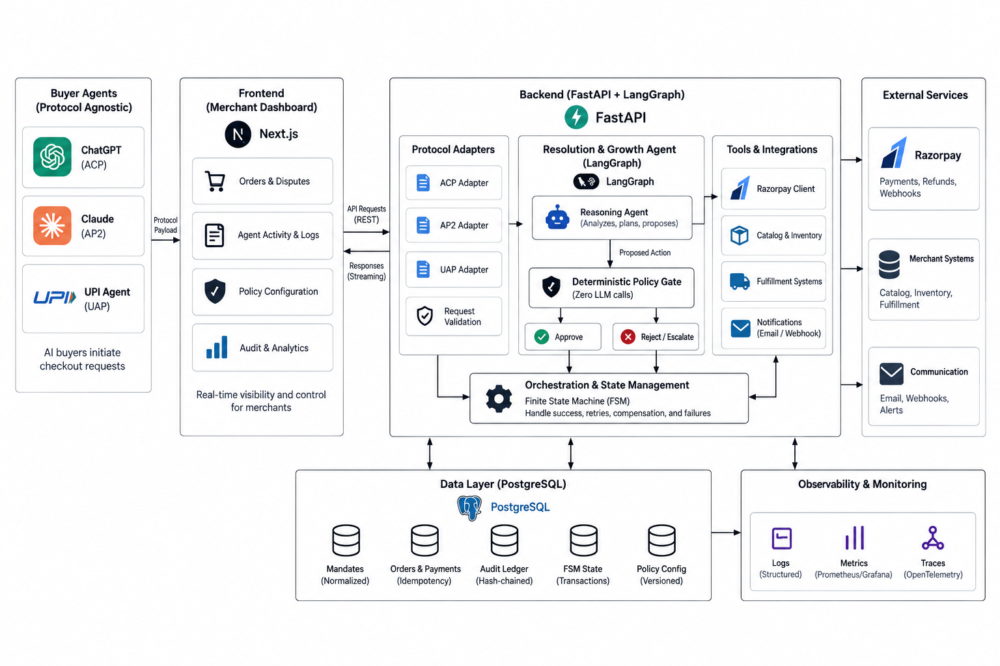

<div align="center">

# Resolution & Growth Agent

**Bounded, gated, and audited agentic commerce resolution for merchants on Razorpay**

[](https://fastapi.tiangolo.com/)
[](https://www.langchain.com/langgraph)
[](https://www.postgresql.org/)
[](https://nextjs.org/)
[](https://razorpay.com/)
[](./backend/tests)
[](./LICENSE)

</div>

<br>

A merchant-side agent that resolves AI-buyer checkout requests, enforces every decision through a deterministic policy gate, and records the whole thing in a tamper-evident audit ledger.

## Why this exists

AI buyer agents are starting to check out on a human's behalf with no human reviewing any individual decision: ChatGPT over the Agentic Commerce Protocol, Claude over UPI-linked consent, anything speaking Google's AP2. Razorpay's own Agent Studio already runs production agents for cart recovery and dispute response, and NPCI's UAP is moving through merchant pilots. The rails to let an agent initiate a payment are arriving fast.

The rails to handle everything around that payment are not. Three gaps in particular:

- **Protocol fragmentation.** A merchant on Claude, ChatGPT, and a UPI-native surface at once is juggling three mandate formats and three audit models. This isn't hypothetical. Google's own UCP initiative exists because the industry has publicly acknowledged this as an unsolved N by N integration problem.
- **The messy middle has no owner.** Prices drift between an agent reading a catalog and checking out. Payments capture while downstream fulfillment times out. Most agentic commerce demos are built for the one path where nothing goes wrong.
- **"The agent decided" is not an audit trail.** A financial system where an LLM's output is the final word on whether money moves is not one a merchant, a payments company, or a regulator can trust. The whole discipline of financial controls exists to make outcomes explainable and reproducible after the fact, and a raw model call has neither property.

This project targets the second and third gaps directly. Protocol-agnostic intake is treated as table stakes; the actual engineering effort goes into the exception-handling and governance layer that almost nothing else in this space is building.

## What this does differently

- **The agent proposes. It never executes.** A LangGraph agent reasons about a checkout situation and proposes one action. A separate, deterministic gate, plain comparisons with zero LLM calls, is the only thing that can turn a proposal into a real Razorpay transaction.
- **Every decision is hash-chained, not just logged.** Approve, reject, or escalate: every outcome writes an append-only row whose hash covers its own content plus the previous row's hash. Editing any row after the fact breaks verification for that row and everything after it.
- **Failure is a first-class state, not an exception handler.** Payment captured but fulfillment failed downstream? An explicit finite-state machine retries, compensates with a refund, or escalates, with an illegal-transition guard that refuses any state jump not in the allowed table.
- **One internal schema, three buyer protocols.** ACP, AP2, and UAP payloads all normalize into the same `Mandate` object before anything else in the system touches them.
- **Idempotency that matches Razorpay's real guarantees, not an assumed one.** Refunds get Razorpay's native idempotency header. Orders don't have one, so this codebase checks its own store before ever calling the API instead of claiming a blanket guarantee that isn't actually true of the underlying platform.

<details>
<summary><strong>Full comparison against a typical agentic checkout demo</strong></summary>
<br>

| Dimension | Typical demo | This project |
|---|---|---|
| Who decides | The LLM call, end to end | Agent proposes, deterministic gate decides |
| Authorization logic | Implicit in a prompt | Versioned policy config, zero LLM in the decision path |
| Audit trail | Application logs, if any | Hash-chained, append-only, tamper-evident |
| Price or inventory drift | Unhandled | Tolerance-banded check: absorb, substitute, or escalate |
| Payment succeeds, fulfillment fails | Undefined | Explicit FSM: retry, compensate, or escalate |
| Multi-protocol support | Hardcoded to one surface | ACP, AP2, and UAP all normalize into one schema |
| Replay protection | None | Session-scoped, correctly distinguishing a fresh replay from a legitimate multi-step session |
| Human escalation | Not modeled | Append-only, resolvable queue backing the dashboard |

</details>

## Quick start

```bash
git clone https://github.com/<you>/resolution-growth-agent.git && cd resolution-growth-agent
docker compose up -d db

cd backend && python3 -m venv venv && source venv/bin/activate
pip install -r requirements.txt
cp .env.example .env
python3 -m pytest tests/ -v
uvicorn app.main:app --reload

cd ../frontend && npm install
cp .env.local.example .env.local
npm run dev
```

Fill in your Razorpay test-mode keys and an LLM key (Groq or Gemini) in `.env` before running the server for real. The test suite needs neither and should show 32 passing.

## System architecture




One hard boundary governs the whole system. Nothing outside `app/policy_gate.py` and `app/razorpay_client.py` may move money or write an authorization decision. Every other component, the protocol adapters, the LangGraph agent, the dashboard API, either produces a proposal or reads a resulting record.

## Repository structure

```
resolution-growth-agent/
├── backend/
│   ├── app/
│   │   ├── mandate.py           # Normalized Mandate schema, ACP/AP2/UAP adapters
│   │   ├── policy_gate.py       # Deterministic authorization: admit, gate, escalate
│   │   ├── ledger.py            # Hash-chained, append-only audit ledger
│   │   ├── agent.py             # LangGraph Resolution & Growth Agent
│   │   ├── razorpay_client.py   # Idempotent orders, refunds, webhook verification
│   │   ├── fsm.py               # Failure recovery: retry, compensate, escalate
│   │   ├── webhook_route.py     # Razorpay webhook receiver, signed and deduped
│   │   ├── dashboard_api.py     # Read/resolve API backing the dashboard
│   │   └── main.py              # FastAPI wiring, CORS, /agent/resolve
│   ├── tests/                   # 32 pytest tests, network boundary mocked only
│   ├── config/policy.yaml       # Per-merchant policy, out of code
│   └── requirements.txt, Dockerfile, pytest.ini, .env.example
├── frontend/
│   ├── app/                     # Next.js 15 App Router
│   ├── components/ResolutionLedger.tsx
│   └── lib/api.ts               # Typed client for the dashboard API
├── docs/architecture.html
├── docker-compose.yml
└── README.md
```

## How a transaction actually resolves

**1. Normalize.** `ACPAdapter`, `AP2Adapter`, and `UAPAdapter` each turn a protocol-shaped payload into the same `Mandate`. An expired or unscoped mandate never becomes an object in the first place; validation runs at construction.

```python
@field_validator("scope")
@classmethod
def scope_not_empty(cls, v):
    if not v:
        raise ValueError("an unscoped mandate is unbounded by definition")
    return v
```

**2. Reason.** The LangGraph agent proposes exactly one next action: accept, substitute, discount, or escalate. It cannot execute anything.

**3. Gate.** Plain comparisons decide approve, escalate, or reject. No model call anywhere in this file.

```python
def apply_discount(self, mandate, sku, discount_pct, order_amount):
    if discount_pct > self.policy.max_auto_discount_pct:
        return self._escalate(mandate, "discount_exceeds_policy", ...)
    return self._approve(mandate, "discount_within_policy", ...)
```

**4. Settle.** Only an approved decision reaches Razorpay. Order creation checks a deterministic `receipt` against existing records first, since Razorpay's Orders API has no native idempotency key, unlike refunds.

**5. Record.** Every outcome, approved, escalated, or rejected, writes a hash-chained row.

```python
def verify_chain(self) -> tuple[bool, Optional[int]]:
    expected_prev = GENESIS_HASH
    for row in rows:
        if row.prev_hash != expected_prev: return False, row.id
        if _compute_hash(row.canonical_payload()) != row.row_hash: return False, row.id
        expected_prev = row.row_hash
    return True, None
```

Resolving a human escalation never edits the original row. It appends a new one referencing it by `mandate_id`. The same rule holds everywhere in this codebase: AI proposes and narrates, code decides and writes.

## Failure recovery

A payment can capture while a merchant's own fulfillment step fails downstream. This is handled as an explicit saga.

```
PENDING_PAYMENT -> PAYMENT_CAPTURED -> FULFILLING -+- FULFILLED
                                                     |
                                                     +- FULFILLMENT_FAILED -+- RETRY_SCHEDULED -> FULFILLING
                                                                            +- COMPENSATING_REFUND -> REFUNDED / FAILED
                                                                            +- ESCALATED
```

A transition outside this table is refused, not silently allowed. See `tests/test_fsm.py::test_illegal_transition_is_refused_not_silently_allowed`. Failure classification defaults to a plain lookup table, and a reason it doesn't recognize escalates instead of guessing.

## Dashboard

Built as a financial register, not a generic analytics grid: tabular monospace for anything structured (amounts, hashes, timestamps), serif for the agent's actual reasoning prose. Open escalations render visibly unresolved (dashed, unfilled). Settled rows render closed. Approving or denying calls `POST /api/escalations/resolve`, which appends rather than edits, so the frontend's write path follows the same discipline as the backend it reads from.

<summary><strong>API reference</strong></summary>
<br>

| Method | Endpoint | Purpose |
|---|---|---|
| `POST` | `/agent/resolve` | Entry point for an AI buyer agent's request (ACP, AP2, or UAP) |
| `POST` | `/webhooks/razorpay` | Payment event receiver, signature-verified and deduplicated |
| `GET` | `/api/ledger` | Recent ledger rows, filterable by outcome |
| `GET` | `/api/escalations` | Currently open escalations |
| `POST` | `/api/escalations/resolve` | Records a merchant decision as a new ledger row |

`POST /agent/resolve` request:
```json
{
  "protocol": "acp",
  "sku": "SKU-9",
  "agent_seen_price": "500.00",
  "live_price": "500.00",
  "order_amount": "500.00",
  "merchant_id": "m-1",
  "payload": { "agent_id": "chatgpt-acp-v1", "signed_cart_token": "...", "...": "..." }
}
```

Response on success:
```json
{
  "outcome": "success",
  "razorpay_order_id": "order_E2E1",
  "amount": "500.00",
  "currency": "INR",
  "history": ["session admitted", "agent proposes: substitute_item ...", "gate outcome: approved (...)"]
}
```

An unresolved request returns `"outcome": "escalated"` or `"failed"` with the same `history` trail. Nothing is charged, and the reasoning is visible in the response itself, not buried in a log.


## Demo scenario

```
T+00s   ACP cart request for SKU-9, agent-seen price Rs 500.
T+00s   Mandate normalized, admitted, session opened.
T+01s   Agent proposes a 3% discount to close the cart.
T+01s   Gate approves, within the 5% ceiling. Razorpay order created.
T+04s   Webhook: payment.captured. FSM begins fulfillment.
T+04s   Downstream fulfillment fails: transient_error. Retry scheduled.
T+05s   Second attempt fails. Retries exhausted, falls through to compensation.
T+05s   Gate approves the refund. Razorpay refund issued.
T+05s   Ledger verified end to end, chain intact across all nine rows.
```

## Tech stack

| Layer | Choice | Why this, not the obvious alternative |
|---|---|---|
| Backend | FastAPI | Pydantic validation is the mandate mechanism itself, not incidental |
| Agent orchestration | LangGraph, not LangChain | Control flow is genuinely cyclical: propose, reject, retry |
| LLM | Groq, with a Gemini fallback | Free tier, fast enough live, swappable behind one `Reasoner` interface |
| Database | PostgreSQL (Neon) | ACID for a financial ledger, JSONB for raw protocol payloads |
| Policy engine | Config-driven rules | Deterministic and inspectable; OPA is the named production upgrade path |
| Audit integrity | Hash-chained table, not a blockchain | The real problem is tamper-evidence on one trusted record, not distributed consensus |
| Saga orchestration | Explicit FSM, not Temporal | Same no-orphaned-state guarantee, zero added infrastructure |
| Frontend | Next.js 15, Tailwind v4 | Ships a typed dashboard against the same contract the backend tests assert |
| Hosting | Vercel, Render, Neon | Free tier throughout |

## Engineering principles

Determinism where money moves. AI only where the judgment is genuinely ambiguous. The authorization decision, the final settled amount, and every ledger write are plain code. An LLM proposes and narrates; it has no write access to Razorpay or the ledger.

No blockchain, no Temporal, no OPA yet, and that's stated plainly rather than hidden. Each is a legitimate production upgrade for a specific piece of this system, and each was left out here because a simpler tool gets the same guarantee at this scale without the added operational surface.

Idempotency claims are protocol-accurate, not blanket. Razorpay gives native idempotency for refunds and not for orders, and this codebase reflects that instead of asserting a uniform guarantee that isn't true of the underlying API.

<summary><strong>Known issues and fixes</strong>, real bugs found while building this, kept here on purpose-</summary>
<br>

| Symptom | Root cause | Fix |
|---|---|---|
| Ledger tamper check flagged untouched rows | `decided_at` stored as timezone-aware `DateTime`; SQLite returns it naive on read, so the pre-write and post-read hash of the same row differed | Frozen as an ISO 8601 string at insert, never reserialized |
| Background webhook handling raised `no such table` | FastAPI's `BackgroundTasks` run on a worker thread; SQLite `:memory:` gives each new connection its own private database | `StaticPool` and `check_same_thread=False`, applied only for `:memory:` engines |
| `/agent/resolve` returned 422 with `req` read as a query param | A Pydantic model was defined locally inside `create_app()`; with `from __future__ import annotations`, FastAPI resolves type hints against the module's global namespace and never found it | Moved the model to module level |
| A `mock.patch()` string target silently stopped working after a refactor | Import paths were rewritten to `app.*` package form; this one patch target string wasn't updated | Fixed to `patch("app.razorpay_client.requests.post")` |
| `pytest` reported collecting 0 items | Test files were print-based scripts, not `def test_*(): assert` functions pytest can discover | Rewritten as real pytest across all 32 tests |
| `AP2Adapter` rejected every real token with `InvalidAudienceError` | PyJWT auto-verifies the `aud` claim the moment it is present, with no expected value ever supplied, and AP2 legitimately uses `aud` to carry the merchant id | `verify_aud: False`, since the signature check already proves authenticity |
| `RAZORPAY_KEY_ID` read as `None` despite a correct `.env` | `python-dotenv` was a listed dependency but `load_dotenv()` was never actually called | Added at module level in `main.py`, before `AppState` is built |
| Groq console showed restricted API key access | Common org or role gating on Groq's console | Added `GeminiReasoner` behind the same `Reasoner` interface as a same-shape fallback |


## Scope and status

This runs entirely against Razorpay's test-mode APIs. No real payment has moved through it. Approving an escalation from the dashboard records the decision to the ledger; it does not yet re-trigger the original transaction with elevated authority, which is a deliberate next step rather than an oversight. Signature verification uses shared-secret HS256 as a stand-in for production per-issuer RS256 and JWKS, a configuration change rather than an architecture change, since every adapter already funnels through one verification function. Nothing here should be treated as production financial infrastructure without a real security review.

## License

<p align="center">
  
</p>

### MIT License

Copyright (c) 2026 Tanay Gujarathi

Permission is hereby granted, free of charge, to any person obtaining a copy
of this software and associated documentation files (the "Software"), to deal
in the Software without restriction, including without limitation the rights
to use, copy, modify, merge, publish, distribute, sublicense, and/or sell
copies of the Software, and to permit persons to whom the Software is
furnished to do so, subject to the following conditions:

The above copyright notice and this permission notice shall be included in all
copies or substantial portions of the Software.

THE SOFTWARE IS PROVIDED "AS IS", WITHOUT WARRANTY OF ANY KIND, EXPRESS OR
IMPLIED, INCLUDING BUT NOT LIMITED TO THE WARRANTIES OF MERCHANTABILITY,
FITNESS FOR A PARTICULAR PURPOSE AND NONINFRINGEMENT. IN NO EVENT SHALL THE
AUTHORS OR COPYRIGHT HOLDERS BE LIABLE FOR ANY CLAIM, DAMAGES OR OTHER
LIABILITY, WHETHER IN AN ACTION OF CONTRACT, TORT OR OTHERWISE, ARISING FROM,
OUT OF OR IN CONNECTION WITH THE SOFTWARE OR THE USE OR OTHER DEALINGS IN THE
SOFTWARE.
